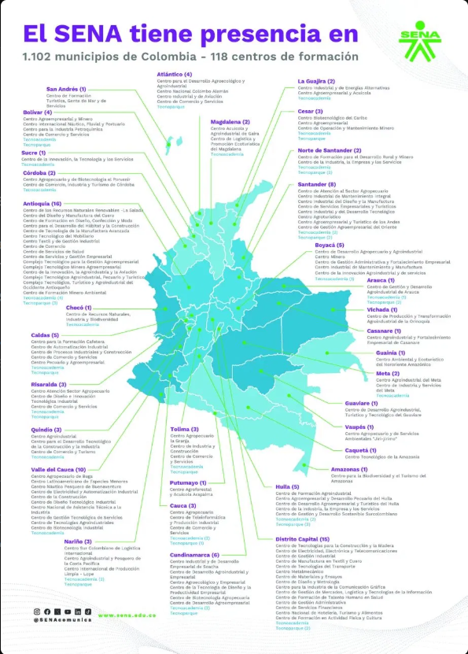

# Módulo 2 — Estructura Institucional SENA
## Entidades, relaciones y justificación

---
Link repo Majo:

[ADSO-3145555/03-execution/15-week/03-optional-activity at main · MariaOyola/ADSO-3145555 · GitHub](https://github.com/MariaOyola/ADSO-3145555/tree/main/03-execution/15-week/03-optional-activity)

Link repo Mariana:

[GitHub - pemarival/15-week_02-06-26_modulo_estructura_institucional_del_sena · GitHub](https://github.com/pemarival/15-week_02-06-26_modulo_estructura_institucional_del_sena)

## Jerarquía del módulo

```
pais
 └── regional  (32 departamentos de Colombia)
       └── municipio  (1.102 municipios con presencia SENA)
             └── centro_formacion  (118 centros oficiales)
                   ├── sede  (ubicaciones físicas del centro)  ←── latitud/longitud OBLIGATORIOS
                   ├── nodo_sena  (Tecnoacademias y Tecnoparques)
                   └── traslado_instructor 

distancia_sedes  (tabla auxiliar: tiempo de desplazamiento entre pares de sedes)
```

---

## Entidades

### 1. `pais`
**¿Para qué?** Raíz de la jerarquía geográfica. Permite que el sistema escale a nivel nacional y sea multi-tenant por país si en el futuro se expande.

**Campos clave:** `nombre` (Colombia), `codigo_iso` (COL)

**Justificación:** El sistema debe ubicar cada regional dentro de un país. Aunque hoy solo opera en Colombia, el campo `codigo_iso` lo prepara para escalamiento. Relacionado con el enfoque multi-tenant del **Módulo 1** mencionado por el instructor.

---

### 2. `regional`
**¿Para qué?** Representa cada departamento de Colombia donde el SENA tiene presencia.

**Campos clave:** `nombre`, `codigo` (Codigo DANE), `total_centros`

**Datos reales de la imagen:**
| Regional | Centros |
|----------|---------|
| Antioquia | 16 |
| Distrito Capital | 15 |
| Valle del Cauca | 10 |
| Santander | 8 |
| Boyacá | 5 |
| Caldas | 5 |
| Huila | 5 |
| Cundinamarca | 6 |
| Bolívar | 4 |
| Atlántico | 4 |
| ... y 22 regionales más | ... |

**Justificación:** La imagen muestra explícitamente las 32+ regionales con sus centros. Sin esta entidad no es posible filtrar centros por región ni gobernar la operación por territorio.

---

### 3. `municipio`
**¿Para qué?** Representa los municipios donde el SENA opera. La imagen indica presencia en **1.102 municipios de Colombia**.

**Campos clave:** `nombre`, `codigo_dane`, `es_capital`

**Justificación:** Un centro de formación puede tener sedes en diferentes municipios del mismo departamento. El `codigo_dane` permite integrarse con sistemas oficiales del Estado colombiano (DANE, SIGEP, etc.).

---

### 4. `tipo_centro`
**¿Para qué?** Clasifica el tipo de centro para diferencias operativas y de reporte.

**Valores:**
- `Centro de Formación` → formación titulada y complementaria
- `Tecnoacademia` → espacios de ciencia y tecnología para niños y jóvenes
- `Tecnoparque` → redes de innovación tecnológica aplicada

**Justificación:** La imagen muestra claramente que no todos los centros son iguales — Antioquia tiene 4 Tecnoacademias y 3 Tecnoparques que operan diferente a los centros regulares. Sin esta clasificación, el sistema no puede diferenciar la oferta académica ni los servicios disponibles.

---

### 5. `centro_formacion` ← **Entidad principal del módulo**
**¿Para qué?** Almacena los 118 centros de formación oficiales del SENA con sus datos completos.

**Campos clave:** `nombre`, `codigo`, `regional_id`, `municipio_id`, `tipo_centro_id`

**Datos reales de la imagen (muestra):**

| Regional | Centro de Formación |
|----------|---------------------|
| Antioquia | Centro de Recursos Naturales Renovables La Salada |
| Antioquia | Centro del Diseño y Manufactura del Cuero |
| Antioquia | Centro Textil y de Gestión Industrial |
| Antioquia | Centro de Comercio |
| Distrito Capital | Centro de Tecnologías para la Construcción y la Madera |
| Distrito Capital | Centro Metalmecánico |
| Distrito Capital | Centro de Diseño y Metrología |
| Valle del Cauca | Centro Agropecuario de Buga |
| Valle del Cauca | Centro Náutico Pesquero de Buenaventura |
| Santander | Centro de Atención al Sector Agropecuario |
| Boyacá | Centro de Desarrollo Agropecuario y Agroindustrial |
| ... | ... (118 centros en total) |

**Justificación:** Es la entidad más importante del módulo. Todo el sistema de gestión de horarios opera **dentro de un centro de formación**. Los instructores, ambientes, fichas y horarios pertenecen a un centro específico. Esta entidad es la FK que conecta el Módulo 2 con todos los demás módulos.

> **Regla de negocio (audio instructor):** Un centro de formación es como una empresa independiente que administra sus propios recursos e instructores. Un instructor pertenece a un único centro a la vez — cuando es prestado, sus horas se transfieren al centro receptor. Ver entidad `traslado_instructor`.

---

### 6. `sede`
**¿Para qué?** Algunos centros de formación tienen múltiples ubicaciones físicas. La sede es la unidad operativa donde se ubican los ambientes de aprendizaje.

**Campos clave:** `nombre`, `direccion`, `latitud` *(NOT NULL)*, `longitud` *(NOT NULL)*, `es_sede_principal`

**Justificación:**
- El **Módulo 3 (Ambientes)** necesita saber en qué sede física está cada aula o laboratorio.
- Los campos `latitud` y `longitud` son **obligatorios** (NOT NULL) porque sin coordenadas reales no es posible calcular tiempos de desplazamiento entre sedes — validación crítica descrita por el instructor.
- El instructor mencionó explícitamente el caso del **Caquetá**, donde algunas sedes quedan a 1-2 horas de la sede principal. Si `latitud`/`longitud` fueran opcionales, esa validación no podría ejecutarse.
- Relacionado con el campo `location` de la entidad `classroom` en **V6** y `room.location` en **V9** de los archivos del instructor.

---

### 7. `nodo_sena`
**¿Para qué?** Registra las Tecnoacademias y Tecnoparques como nodos especiales ligados a un centro de formación.

**Campos clave:** `tipo_nodo` (Tecnoacademia | Tecnoparque), `numero_nodo`, `municipio_id`

**Datos reales de la imagen:**
| Regional | Tecnoacademias | Tecnoparques |
|----------|---------------|-------------|
| Antioquia | 4 | 3 |
| Santander | — | 2 |
| Huila | 2 | 3 |
| Valle del Cauca | 1 | — |
| Cundinamarca | 2 | — |
| ... | ... | ... |

**Justificación:** La imagen muestra explícitamente las Tecnoacademias y Tecnoparques como subentidades de los centros. Tienen su propia ubicación, programas específicos y operación diferenciada. No modelarlos sería ignorar una parte real de la estructura del SENA.

---

### 8. `distancia_sedes` ← **Nueva entidad 
**¿Para qué?** Precalcula y almacena el tiempo estimado de desplazamiento en minutos entre cada par de sedes del SENA.

**Campos clave:**

| Campo | Tipo | Descripción |
|-------|------|-------------|
| `sede_origen_id` | FK → sede | Sede de partida |
| `sede_destino_id` | FK → sede | Sede de llegada |
| `distancia_km` | decimal | Kilómetros entre las dos sedes |
| `tiempo_minutos` | integer | Tiempo estimado de desplazamiento |
| `medio_transporte` | enum | `vehiculo`, `moto`, `transporte_publico` |
| `ultima_actualizacion` | timestamp | Para saber cuándo recalcular |

**Justificación (cita directa del instructor):**
> *"No tendría sentido que le cargue de 6-9 en el 209 de Industria pero después le cargue el 105 en Comercio a las 9... va a llegar tarde sí o sí. Hay centros de formación donde tienen sedes que quedan una, dos horas de la sede principal."*

El Motor de Horarios (**Módulo 8**) consulta esta tabla **antes de asignar un bloque** para verificar que el instructor tenga tiempo físicamente suficiente para desplazarse entre dos sedes consecutivas. Sin esta tabla, el sistema podría generar horarios físicamente imposibles de cumplir.

**Relación con `sede`:** Es una tabla auxiliar muchos-a-muchos entre `sede` y `sede`. La clave primaria compuesta es `(sede_origen_id, sede_destino_id, medio_transporte)`.

---

### 9. `traslado_instructor` ← **Nueva entidad 
**¿Para qué?** Registra cuando un instructor es "prestado" temporalmente de su centro de formación de origen a otro centro receptor, transfiriendo con él sus horas disponibles.

**Campos clave:**

| Campo | Tipo | Descripción |
|-------|------|-------------|
| `instructor_id` | FK → instructor | El instructor trasladado |
| `centro_origen_id` | FK → centro_formacion | Centro que cede al instructor |
| `centro_destino_id` | FK → centro_formacion | Centro que recibe al instructor |
| `fecha_inicio` | date | Inicio del traslado |
| `fecha_fin` | date (nullable) | Fin del traslado (null = indefinido) |
| `horas_asignadas_destino` | integer | Horas que tendrá disponibles en el centro receptor |
| `estado` | enum | `activo`, `finalizado`, `cancelado` |
| `motivo` | text | Razón del traslado |

**Justificación (cita directa del instructor):**
> *"Un instructor puede ser prestado para que vaya a Campo Alegre... inmediatamente deja de tener acceso a horas de acá y pasa a tener horas de otro centro. Un centro es como una empresa que administra sus propios recursos, sus propios instructores."*

Mientras un `traslado_instructor` esté en estado `activo`, el **Módulo 8 (Horarios)** bloquea la asignación de horas al instructor en su `centro_origen_id` y las habilita únicamente en `centro_destino_id`. Esta lógica es imposible de implementar sin registrar explícitamente el traslado en la base de datos.

**Relación con otros módulos:**
- **Módulo 7 (Instructores):** La tabla `instructor` mantiene su `centro_formacion_id` de origen; el traslado es temporal y queda auditado aquí.
- **Módulo 8 (Horarios):** Antes de asignar un bloque horario, el motor verifica si el instructor tiene un traslado activo para determinar en qué centro puede tener horas.

---

## Relaciones del módulo

```
pais (1) ────────< (N) regional
regional (1) ────────< (N) municipio
regional (1) ────────< (N) centro_formacion
municipio (1) ────────< (N) centro_formacion
municipio (1) ────────< (N) sede
tipo_centro (1) ────────< (N) centro_formacion
centro_formacion (1) ────────< (N) sede
centro_formacion (1) ────────< (N) nodo_sena
municipio (1) ────────< (N) nodo_sena
sede (1) ────────< (N) distancia_sedes [como sede_origen]
sede (1) ────────< (N) distancia_sedes [como sede_destino]
instructor (1) ────────< (N) traslado_instructor
centro_formacion (1) ────────< (N) traslado_instructor [como centro_origen]
centro_formacion (1) ────────< (N) traslado_instructor [como centro_destino]
```

---

## Reglas de negocio derivadas del audio del instructor

| # | Regla | Entidades implicadas | Módulo que la ejecuta |
|---|-------|---------------------|----------------------|
| RN-01 | Un instructor pertenece a un solo centro a la vez; el traslado transfiere sus horas | `traslado_instructor`, `instructor` | Módulo 8 — Horarios |
| RN-02 | No se puede asignar al mismo instructor en dos sedes si el tiempo de desplazamiento es insuficiente entre bloques | `distancia_sedes`, `sede`, `bloque_horario` | Módulo 8 — Horarios |
| RN-03 | `latitud` y `longitud` de `sede` son obligatorios (NOT NULL) para que RN-02 pueda calcularse | `sede` | Módulo 2 — Infraestructura |

---

## Cómo conecta con los otros módulos

| Módulo | FK que usa de este módulo |
|--------|---------------------------|
| Módulo 1 — Seguridad | `usuario.centro_formacion_id` → multi-tenant por centro |
| Módulo 3 — Ambientes | `ambiente.sede_id` → el aula pertenece a una sede |
| Módulo 7 — Instructores | `instructor.centro_formacion_id` → el instructor pertenece a un centro |
| Módulo 6 — Oferta | `ficha_formacion.centro_formacion_id` → la ficha se ejecuta en un centro |
| Módulo 8 — Horarios | `bloque_horario` consulta `distancia_sedes` y `traslado_instructor` antes de asignar |

---

## Fuentes

| Entidad | Fuente archivo instructor | Fuente imagen/SENA | Fuente audio instructor |
|---------|--------------------------|---------------------|------------------------|
| `pais` | Contexto general del sistema | Estructura territorial colombiana | — |
| `regional` | Contexto V8 "training center" | 32+ regionales en la imagen | — |
| `municipio` | `classroom.location` V6, `room.location` V9 | "1.102 municipios" — imagen | — |
| `tipo_centro` | Implícito en estructura V8/V9 | Tipos en imagen: centro, Tecnoacademia, Tecnoparque | — |
| `centro_formacion` | `training_center` V8/V9, contexto V6-V9 | 118 centros con nombres reales | Centro = empresa independiente con sus propios recursos |
| `sede` | `classroom.location` V6, `location` V7/V9 | Múltiples ubicaciones por centro | Caso Caquetá: sedes a 1-2 horas; latitud/longitud NOT NULL |
| `nodo_sena` | No está en archivos | Tecnoacademias y Tecnoparques — imagen | — |
| `distancia_sedes` | No está en archivos | No está en imagen | Validación de tiempo entre sedes consecutivas en horario |
| `traslado_instructor` | No está en archivos | No está en imagen | Instructor "prestado" a otro centro, pierde horas en origen |
